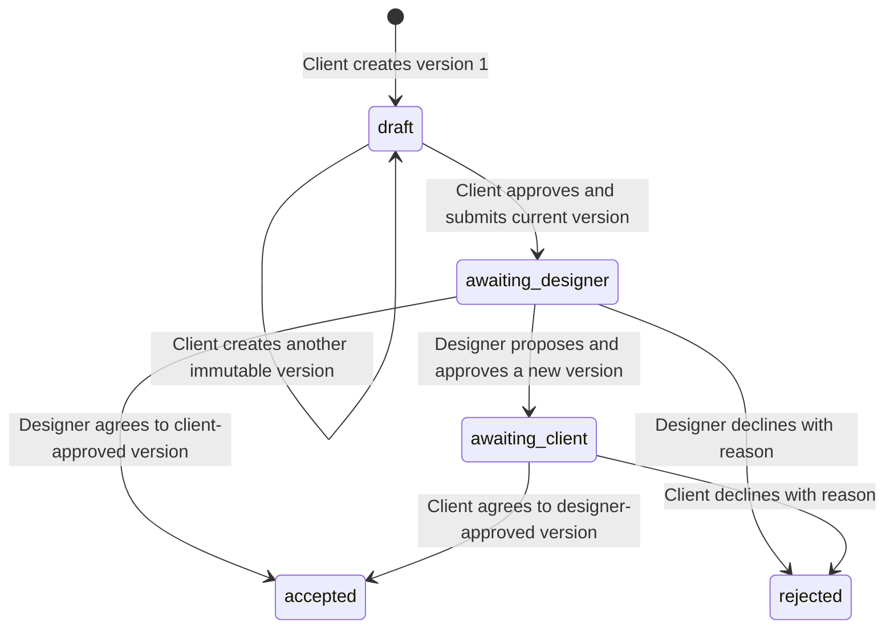

# Daayra — Client Change Portal

A Flask workspace for a fictional Ahmedabad design studio and its clients. Keep the original brief, turn new requests into immutable versions and update price/delivery only when both people agree to the **same** version.

The ink-and-lilac interface uses an editorial brief, a change journal and a decision timeline. This is a local portfolio demo; it never creates a legal contract, takes payment or contacts a client.

## Working screenshots


## The problem and workflow

A client asks for an extra deliverable. The designer agrees to part of it, but with a different price or timeline. A chat thread can obscure which version was actually approved. Daayra keeps the initial agreement fixed and asks both parties to approve the same proposed terms.

- **Client drafts:** write deliverables, an exact INR adjustment and a delivery-day adjustment.
- **Client consent:** submitting a draft approves that version and sends it to the assigned designer.
- **Designer review:** accept those terms, decline with a reason, or propose a new version.
- **Fresh consent:** a designer revision clears the old client approval and awaits the client’s decision on the new terms.
- **Pinned acceptance:** only the exact accepted version contributes to the current project plan.
- **Bounded attachments:** client drafts accept UTF-8 text or PDF-signature files up to 256 KiB; files stay tied to their version and download requires project access.
- **Retained history:** original scope, old versions, attachments and decision events cannot be overwritten through the application.

## Assumptions

Ishita Shah, Dev Patel, Nisha Rao, Meera Foods, Tara Books and every brief are fictional hand-written fixtures. They model a small studio workflow; they are not claimed to come from interviews or real client activity.

The demo assumes one assigned designer and one client per project. A price adjustment may be positive or negative; a delivery adjustment may extend or shorten the plan. Accepted adjustments are summed against the original estimate. The total cannot become negative, and delivery cannot drop below one day. The estimate is not an invoice, payment or legal agreement.

Accounts are genuine local hashed-password sessions with server-side ownership checks. They are intentionally public demo identities. This project does not provide account registration, password resets, legally valid electronic signatures, real billing, multi-company tenancy, email notifications or production deployment.

## Stack

Python 3.12, Flask 3.1, SQLite, Werkzeug scrypt password hashing, cookie sessions/CSRF, plain HTML/CSS and vanilla JavaScript. Monetary input is parsed with `Decimal`, then stored and summed as integer paise. No paid API or frontend build tool is required.

## Setup

Use Python **3.11 or newer**. Open a shell in the repository root after cloning or extracting a ZIP.

```bash
git clone https://github.com/Siddh-sys-rgb/daayra-client-change-portal.git
cd daayra-client-change-portal
```

### macOS / Linux

```bash
python3 -m venv .venv
source .venv/bin/activate
python -m pip install -r requirements-dev.txt
python app.py --port 8113
```

### Windows PowerShell

```powershell
py -3 -m venv .venv
.\.venv\Scripts\python.exe -m pip install -r requirements-dev.txt
.\.venv\Scripts\python.exe app.py --port 8113
```

Open **http://127.0.0.1:8113**. Use `Ctrl+C` to stop. Runtime-only installation uses `requirements.txt`; `requirements-tested.txt` records the exact environment used for local verification.

### Source-independent launch

The default database, templates and assets resolve from `app.py`, independently of the current shell directory.

```bash
/full/path/daayra-client-change-portal/.venv/bin/python /full/path/daayra-client-change-portal/app.py --port 8113 --data-dir /full/path/daayra-demo-data
```

```powershell
& "C:\full\path\daayra-client-change-portal\.venv\Scripts\python.exe" "C:\full\path\daayra-client-change-portal\app.py" --port 8113 --data-dir "C:\full\path\daayra-demo-data"
```

The server binds **127.0.0.1** with debug disabled. `--no-demo` initializes empty storage for inspection/testing and does not create usable accounts. Non-demo provisioning is outside this release.

## Demo identities

| Persona | Email | Password | Projects |
|---|---|---|---|
| Ishita Shah · designer | `designer@daayra.demo` | `Studio@2026` | Both assigned projects |
| Dev Patel · client | `dev@daayra.demo` | `Client@2026` | Meera Foods identity kit |
| Nisha Rao · client | `nisha@daayra.demo` | `Client@2026` | Tara Books landing page |

Shortcuts on the sign-in form fill these credentials; the backend still verifies the stored hash and account ownership.

## Five-minute walkthrough

1. Sign in as Ishita. The left navigation shows two assigned projects. Open Meera Foods’ festival packaging request.
2. Inspect version 1: the client has already submitted it. Choose **Write a new version**, change the price/deliverables and save. Version 1 stays visible, while version 2 awaits the client.
3. Sign out and sign in as Dev. Open the same request, compare versions and choose **Agree to this version**. The exact version is pinned; the current project price and delivery estimate update.
4. Choose **Write a change brief** to create a different draft. Open it, optionally attach a small `.txt` brief and select **Approve & send to designer**.
5. Sign in as Ishita and decline that request with a reason. The timeline retains the rejection and the project plan is unaffected.
6. Sign in as Nisha. Meera Foods and its requests/attachments are inaccessible; only Tara Books is visible.

For a shorter happy path, Ishita can accept the seeded festival request without making a counterproposal. Acceptance is terminal: further edits, approvals and attachments fail.

## State transitions



Accepted and rejected requests are final. This release supports one designer counterproposal per submitted request; a declined proposal can lead to a separate new draft. Every mutation supplies the current row revision, so a stale browser cannot silently approve different terms.

## Attachments

- Uploaded bytes are stored as a BLOB inside SQLite, outside public static assets.
- Only the project client can attach a file while the request is a **draft**.
- The file belongs to the current immutable version; a later revision does not silently inherit it.
- Old attachments remain available for history, with their version labels visible.
- Uploading increments the request revision, so a concurrent submission must refresh.
- Filenames are sanitized; downloads use `Content-Disposition: attachment` and `nosniff`.
- UTF-8 text is checked for invalid encoding/null bytes. PDFs require a `%PDF-` signature. Signature checking is **not** antivirus scanning or full PDF validation.
- After submission/acceptance, no attachment can be added to that approved version. There is no replacement/delete API, and database triggers reject attachment rewrites.

## Data and reset

Ignored `instance/` contains `app.sqlite3`, its optional WAL/SHM files and the persistent `.session-secret`. The secret is created with owner-only permissions. Restarting preserves work; seeding happens only for a database without users.

To reset fictional data, stop the app and remove the entire data directory, then launch again. The initial briefs/accounts are recreated. Do not commit runtime files or replace the secret in an existing instance merely to reset a login.

## API

Obtain a cookie and `csrf_token` from `GET /api/session`. Send `X-CSRF-Token` on every POST, including sign-in/sign-out. Tokens rotate on sign-in/sign-out. Keep the same cookie jar across requests. JSON endpoints require `Content-Type: application/json`; attachments use multipart form data. API responses are not cached.

| Method | Route | Purpose |
|---|---|---|
| GET | `/api/health` | Storage availability; public |
| GET | `/api/session` | User, CSRF token and demo flag |
| POST | `/api/login` | `{email, password}` |
| POST | `/api/logout` | Clear the session |
| GET | `/api/projects` | Owned projects, original/current plan and scoped requests |
| POST | `/api/requests` | Client draft: `{project_id,title,description,amount,days}` |
| GET | `/api/requests/{id}` | Immutable versions and attachment metadata |
| POST | `/api/requests/{id}/revise` | `{revision,title,description,amount,days}` |
| POST | `/api/requests/{id}/submit` | Client approves draft: `{revision}` |
| POST | `/api/requests/{id}/approve` | Awaited party accepts exact version: `{revision}` |
| POST | `/api/requests/{id}/reject` | Awaited party declines: `{revision,reason}` |
| GET | `/api/requests/{id}/events` | Ownership-scoped decision trail |
| POST | `/api/requests/{id}/attachments` | Multipart `file` and `revision` |
| GET | `/api/attachments/{id}` | Authenticated, ownership-checked download |

Example draft body:

```json
{"project_id":1,"title":"Add print labels","description":"Three print-ready pack labels using the approved identity.","amount":"4500.00","days":3}
```

`amount` is a **string**, not a floating-point JSON number. It permits at most two decimal places and an adjustment up to ₹10,00,000 in either direction. `days` is an integer from -90 through 90. Validation returns `400`, sign-in required `401`, forbidden access/CSRF/origin `403`, inaccessible records `404`, stale revision/state/aggregate conflicts `409`, oversized upload `413`, failed-sign-in throttle `429` and temporary storage failure `503`.

## Architecture and schema

```text
HTML/CSS/JS → app.py (HTTP, sessions, CSRF, ownership, attachment transport)
                    → domain.py (proposals, transitions, aggregate validation)
                    → core.py (SQLite, transactions, parsing/auth helpers)
                    → SQLite (WAL, foreign keys, immutability triggers)
```

| Table | Responsibility |
|---|---|
| `users` | Roles and scrypt password hashes |
| `projects` | Fixed initial scope/price/delivery and assigned parties |
| `requests` | State, revision, current version, each party’s approval and accepted version |
| `versions` | Append-only scope/price/time snapshots and authors |
| `attachments` | Immutable bounded bytes, SHA-256 and originating version |
| `events` | Append-only decision trail and actor |
| `login_attempts` | Fifteen-minute failed-login throttle per hashed email identity |

Changes run inside `BEGIN IMMEDIATE`. The version, approval changes and event commit together; an audit failure rolls them all back. Accepted aggregates are checked inside the same write transaction, so concurrent discounts cannot overdraw a project’s price. Version numbers describe immutable proposal content; row revisions detect stale state and attachments. Cookie name `daayra_session` keeps this app’s local session separate from other demos.

SQLite is an intentional fit for a small local studio demo. It serializes writes rather than claiming distributed concurrency. Project creation/provisioning is seeded rather than exposed through the UI; there is no production scaling claim or external dependency on a workflow service.

## Verification

```bash
python -m pytest --cov=app --cov=core --cov=domain --cov-report=term-missing --cov-fail-under=90
python -m pip check
node --check static/app.js
```

Node is optional for operation, and only used for the syntax check. The local suite has **89 passing tests** covering ownership, authentication/CSRF, exact decimal input, immutable versions, fresh consent after revision, terminal acceptance/rejection, schedule/price limits, simultaneous approvals/discounts, audit rollback and attachment/submission races. Temporary databases isolate tests from the working demo.

[`docs/verification.json`](docs/verification.json) records combined statement-and-branch coverage; browser rendering is outside that metric. A Windows/Linux CI matrix and real desktop/mobile captures are included. Private implementation notes and learning exercises stay outside this repository.

## Files

```text
app.py                 Factory, HTTP API, attachment transport, CLI
core.py                Auth, validation and transaction infrastructure
domain.py              Schema, proposals and consent/state rules
templates/index.html   Client/designer forms and review dialogs
static/                Distinct editorial theme + browser interactions
tests/                 Isolated behavior, concurrency and failure tests
docs/                  Evidence and working screenshots
requirements*.txt      Runtime, development and tested environments
.github/workflows/     CI checks
```

## Interview discussion points

How does a counterproposal invalidate consent? Why store both accepted version and current version? Why can an attachment race invalidate submission? Why validate the aggregate budget under a writer lock? These decisions provide concrete examples of product ambiguity becoming explicit implementation rules.
